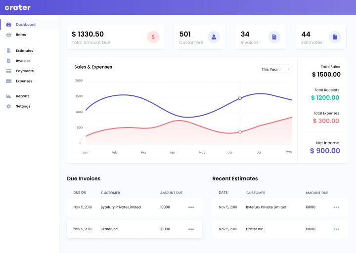

<!--
NOTA: Este README foi creado automáticamente por <https://github.com/YunoHost/apps/tree/master/tools/readme_generator>
NON debe editarse manualmente.
-->

# InvoiceShelf para YunoHost

[](https://ci-apps.yunohost.org/ci/apps/invoiceshelf/)


[](https://install-app.yunohost.org/?app=invoiceshelf)

*[Le este README en outros idiomas.](./ALL_README.md)*

> *Este paquete permíteche instalar InvoiceShelf de xeito rápido e doado nun servidor YunoHost.*  
> *Se non usas YunoHost, le a [documentación](https://yunohost.org/install) para saber como instalalo.*

## Vista xeral

InvoiceShelf is an open-source web & mobile app that helps you track expenses, payments & create professional invoices & estimates.

⚠️ Note: You will have to do some configuration by hand. But don't worry, a message will be showed at the end of the installation to guide you step by step!


**Versión proporcionada:** 2.0.0~ynh1

## Capturas de pantalla



## Documentación e recursos

- Web oficial da app: <https://invoiceshelf.com>
- Documentación oficial para usuarias: <https://docs.invoiceshelf.com/>
- Repositorio de orixe do código: <https://github.com/InvoiceShelf/InvoiceShelf>
- Tenda YunoHost: <https://apps.yunohost.org/app/invoiceshelf>
- Informar dun problema: <https://github.com/YunoHost-Apps/invoiceshelf_ynh/issues>

## Info de desenvolvemento

Envía a túa colaboración á [rama `testing`](https://github.com/YunoHost-Apps/invoiceshelf_ynh/tree/testing).

Para probar a rama `testing`, procede deste xeito:

```bash
sudo yunohost app install https://github.com/YunoHost-Apps/invoiceshelf_ynh/tree/testing --debug
ou
sudo yunohost app upgrade invoiceshelf -u https://github.com/YunoHost-Apps/invoiceshelf_ynh/tree/testing --debug
```

**Máis info sobre o empaquetado da app:** <https://yunohost.org/packaging_apps>
